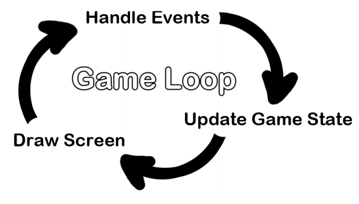

Capítulo 2 - Noções básicas de Pygame 11

Tomando dano(o que baixa o valor de sua vida), ou um inimigo que se move, ou algo acontece no mundo do jogo,nós dizemos que o estado do jogo mudou.

Se você já jogou um jogo que permite que você salve, o "salvar estado" é um estado de jogo no momento em que você salvou.Na maioria dos jogos
, pausar o jogo previnirá que o estado do jogo mude.

Desde de que o estado do jogo é usualmente atualizado em respostas á eventos( tais como o clique do mouse ou pressionar teclas do teclado) ou
a passagem do tempo, o loop do jogo é constatemente verificado e verificado novamente muitas vezes por segundo para qualquer novo evento que
aconteceu.Dentro do loop principal está o código que verifica que eventos foram criados(no Pygame, isso é feito chamando a função
 `pygame.event.get()` ).O loop principal também contém código que atualiza o estado do jogo baseado em que eventos foram criados.Isso é usual
mente chamado manipulação de eventos.

#### Objetos pygame.event.Event

A qualquer momento que o usuário faz uma das várias ações(elas serão listadas mais tarde nesse capítulo) como pressionar uma tecla ou mover o
mouse na janela do programa, um objeto `pygame.event.Event` é criado pelo Pygame para registrar o "evento". (Isso é um tipo de objeto chamado
`Event` que existe no módulo event, que é um módulo do pygame.) Nós podemos descobrir quais eventos estão acontecendo chamando a função 
`pygame.event.get()`, que retorna uma lista dos objetos `pygame.event.Event`(que nós iremos apenas chamar de objetos Event para encurtar).

A lista de objetos Event irá conter cada evento que aconteceu desde a última vez que a função `pygame.event.get()` foi chamada.(Ou, se `pygame
.event.get()` nunca foi chamada, a lista irá conter todos os objetos desde o início do programa.) 

