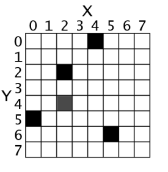

Capítulo 2 - Noções basicas de Pygame 13

A linha 12 chama a função `pygame.display.update()`, que desenha o objeto Surface retornado por `pygame.display.set_mode()` na tela(lembre-se
que nós á guardamos na variável DISPLAYSURF).Desde que o objeto Surface não mudou( por exemplo, por alguma função de desenho que serão explica
das mais tarde nesse capítulo), a mesma imagem preta é redesenhada na tela cada vez que `pygame.display.update()` é chamado.

Esse é o programa inteiro.Após a linha 12 for executada, o loop infinito inicia novamente do começo.Esse programa não faz nada além de fazer
uma janela preta aparecer na tela, constantemente verificando por um evento do tipo QUIT, e então redesenhar a inalterada janela preta na tela
novamente.Vamos aprender como fazer coisas interessantes aparecem na tela ao invés de apenas a cor preta aprendendo sobre pixels, objetos Surface,
objetos Color, objetos Rect e as funções de desenho do Pygame.

#### Coordenadas do pixel

A janela que o programa "Olá Mundo" criou é apenas composta de pequenos pontos quadrados na sua tela chamados pixels.Cada pixel inicia preto,
mas a sua cor pode ser mudada.Imagine que ao invés de um objeto Surface que possui 400 pixels de largura e 300 de altura, nós tivéssemos um objeto
Surface que possuísse 8 pixels por 8 pixels.Se esse pequeno objeto Surface fosse aumentado para que cada pixel se parecesse com um quadrado em uma
grade, e adcionássemos números para os eixos X e Y, então uma boa representação se pareceria como isso:

Podemos nos referir a um pixel específico usando o sistema de coordenadas cartesianas.Cada coluna do eixo X e cada linha do eixo Y terá um endereço
que é um inteiro de 0 até 7, então nós temos que alocar cada pixel específicando os inteiros dos eixos X e Y.

Por exemplo, na imagem 8x8 acima , nós podemos ver que os pixels nas coordenadas XY (4,0), (2,2), (0,5) e (5,6) estão pintadas de preto, e o pixel em
(2,4) está pintado de cinza, enquanto todos os outros pixels estão pintados de branco.Coordenadas XY também são chamadas de pontos.Se você teve aulas
de matemática e aprendeu sobre coordenadas cartesianas, você pode notar que o eixo Y começa em 0 no topo e então aumenta para baixo,em vez de aumentar
para cima.É assim que coordenadas cartesianas funcionam no Pygame( e em quase todas as linguagens de programação).

