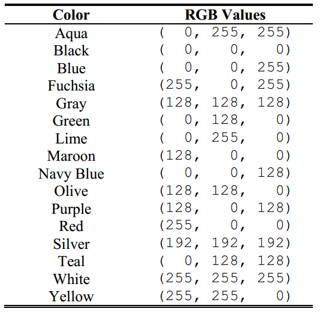

16 http://inventwithpython.com/pygame

#### Cores

Existem três cores primárias de luz: vermelho, verde e azul. (Vermelho, azul e amarelo são as cores primarias para pinturas e pigmentos, mas o computador
usa luz, não pintura.) Pela combinação de diferentes combinações dessas três cores é possível formar qualquer outra cor.No Pygame, nós representamos
cores como tuplas de três inteiros.O primeiro valor na tupla é a proporção de vermelho na cor.Um valor inteiro igual á 0 significa que a cor não possui
a tonalidade vermelha, e o valor de 255 significa que é a proporção máxima de vermelho.O segundo valor é para o verde e o terceiro para o azul.
Essas tuplas de três inteiros usadas para representar uma cor é também chamada de valores *RGB*.

Porque você pode usar qualquer combinação de 0 até 255 de cada uma das cores primárias, isso significa que o Pygame pode desenhar 16,777,216 cores 
diferentes(isso é, 256 x 256 x 256 cores).Entretanto, se você tentar usar um número maior que 255 ou um número negativo, você irá obter o seguinte erro:

	ValueError: invalid color argument.

Por exemplo, nós criamos a tupla (0, 0, 0) e a guardamos em uma váriavel chamada BLACK.Sem vermelho, verde, ou azul, o resultado da cor é preto.A cor
preta é a ausência de qualquer cor.A tupla (255, 255, 255) com a proporção máxima de vermelho, verde e azul resulta na cor branca.A cor branca é a 
combinação do máximo de vemelho, verde e azul.A tupla (255, 0, 0) representa q proporção máxima de vermelho, mas sem verde ou azul, então a cor resultante
é vermelho.Igualmente, (0, 255, 0) é verde e (0, 0, 255) é azul.

Você pode misturar as proporções de vermelho, verde e azul para formar outras cores.Aqui estão os valores RGB para algumas cores comuns:

> Envie questões por E-mail para o autor: al@inventwithpython.com

