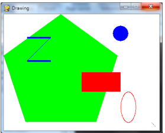

22 http://inventwithpython.com/pygame

Perceba como nós construímos constantes para cada uma das cores.Fazendo isso torna nosso código mais legível, porque vendo GREEN no código é muito
mais fácil de entender do que representar a cor verde com (0, 255, 0).

As funções de desenho são nomeadas com o nome das formas que elas desenham.
Os parâmetros que você passa para essa funções dizem em que objeto Surface
desenhar, onde desenhar (e o tamanho), com qual cor, e a largura das linhas.
Você pode ver como esssas funções são chamadas no programa drawing.py, mas
aqui está uma pequena descrição de cada função:

* fill(color) - O método fill() não é uma função e sim um método dos objetos pygame.Surface.Esse método preenche completamente um objeto Surface com qualquer cor que você passa como paramêtro.
* pygame.draw.poligon(surface, color, pointlist, width)- Um poligono é uma forma feita de lados planos.os parâmetros `surface` e `color` informam para
a função em que superfície desenhar e qual será a cor.O paramêtro pointlist
é uma tupla ou lista de pontos(isso é, uma tupla ou lista com uma tupla de 
dois inteiros para as coordenadas X e Y).O poligono é feito desenhando linhas entre cada ponto e o ponto que vem depois da tupla.Então uma linha é desenhada a partir do último ponto para o primeiro.Você também pode passar uma lista de pontos ao invés de uma tupla de pontos.
O paramêtro `width` é opcional.Se voce não passá-lo o poligono será preenchido, do mesmo jeito que o nosso poligono verde na tela foi preenchido com essa cor.Se você passar um valor inteiro para o paramêtro `width` , apenas a linha de fora do poligono será desenhada.O inteiro representa a quantidade de pixels a largura a linha do poligono será.Passando 1 para o paramêtro `width` irá torná-lo fino, enquanto que passando 4 ou 10 ou 20 o tornará bem largo.Se você passar o inteiro 0 para o paramêtro `width`, o poligono será preenchido(do mesmo jeito que você não passar paramêtro para `width`).

Todas as funções de desenho `pygame.draw` possuem o paramêtro opcional `width` como último paramêtro, e eles funcionam do mesmo jeito do paramêtro `width` de `pygame.draw.polygon`.Provávelmente um nome melhor para paramêtro `width` deveria ser `thickness`, porque esse paramêtro controla o quando sua linha é fina.

> Mande questões por E-mail para o autor: al@inventwithpython.com

