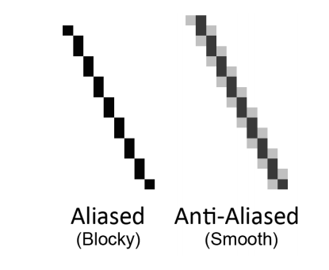

30 http://inventwithpython.com

4. Ajuste a posição do objeto Rect mudando um de seus atríbutos.Na linha 15, nós configuramos o centro do objeto Rect para ser em 200, 150.
5. Copie o objeto Surface com o texto para o objeto Surface retornado por `pygame.display.set_mode()` (linha 19).
6. Chame  a função `pygame.display.update()` para fazer o display Surface aparecer na tela(linha 24)

Os parâmetros para a função construtora ` pygame.font.Font() ` são uma string com o texto para renderizar, um valor booleano para especificar se nós queremos usar anti-aliasing (explicado posteriormente nesse capítulo), a cor do texto, e a cor de fundo.Se você quer um fundo transparente, então simplesmente não passe nada para esse parâmetro.

#Anti-Aliasing

Anti-aliasing é uma técnica gráfica para fazer textos e formas menos quadradas, aplicando um pequeno borrão (blur) em seus cantos.Isso leva um pouco de tempo a mais para ser processado, então seus programas terão gráficos melhores, porém eles executarão um pouco mais devagar(só um pouco).

Se você der um zoom em uma linha com anti-aliasing e uma linha sem anti-aliasing:

Para fazer o texto do pygame usar anti-aliasing, apenas passe `True` como segundo parâmetro do método `render()`.As funções `pygame.draw.aaline()` e `pygame.draw.aalines` possuem os mesmos parâmetros da função `pygame.draw.line()` e

> Mande questões por E-mail para o autor: al@inventwithpython.com

