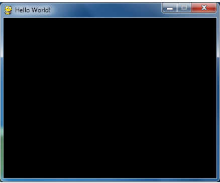

8 http://inventwithpython.com/pygame

Lembre-se, de não digitar os números ou pontos que aparecem no inicio de cada linha(eles são apenas para referência no livro).

	1. import pygame, sys
	
	2. from pygame.locals import *

	3.

	4. pygame.init()

	5. DISPLAYSURF = pygame.display.set_mode((400,300))

	6. pygame.display.set_caption('Olá Mundo')

	7. while True: # loop principal do jogo

	8.	for event in pygame.event.get():

	9.		if event.type == QUIT:

	10.			pygame.quit()

	11.			sys.exit()

	12.			pygame.display.update()

Quando você executar esse programa, uma janela preta como essa irá aparecer:

Uhul! Você cabou de criar o jogo mais tediante do mundo! É apenas uma janela vazia com "Olá Mundo!" no topo da janela( que é chamado de 
barra de título, que contém o texto de caption).Mas criar uma janela é o primeiro passo para fazer jogos gráficos.Quando voce clicar no botão
X no canto da janela, o programa iá encerrar e a janela desaparecer.

Chamando a função print() para fazer o texto aparecer na janela não funcionará porque print() é uma função para programas em CLI.O mesmo para
a função input() para receber entradas do teclado do usuário.Pygame utiliza outras funções para entrada e saída que são explicadas nesse capítulo.Por enquanto, vamos ver cada linha no nosso programa "Olá Mundo!" detalhadamente.

#### Configurando um programa em Pygame

As primeiras poucas linhas de código do nosso programa Olá Mundo são as linhas que iniciarão praticamente oque todo programa em Pygame utiliza

	1. import pygame, sys
	2. 
> Mande questões por E-mail para o autor : al@inventwithpython.com

